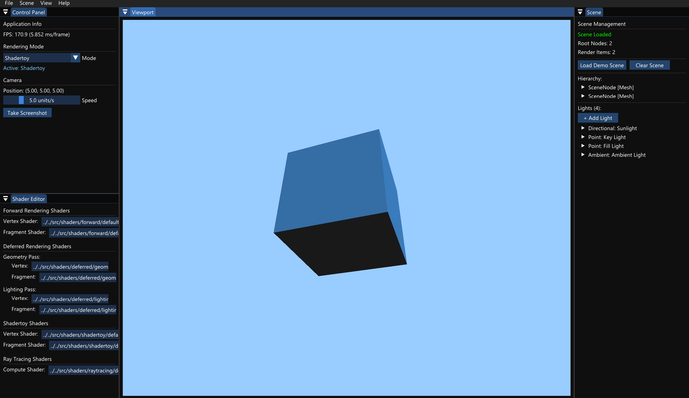
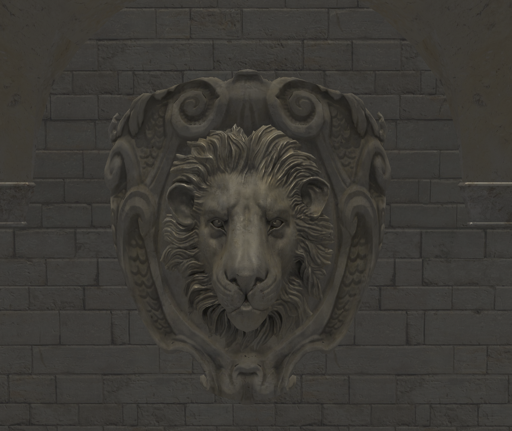
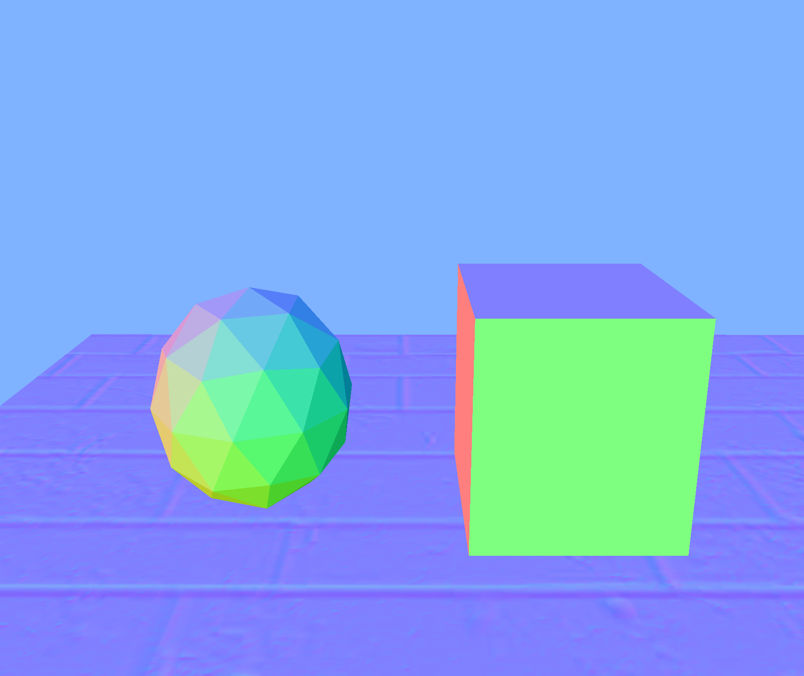
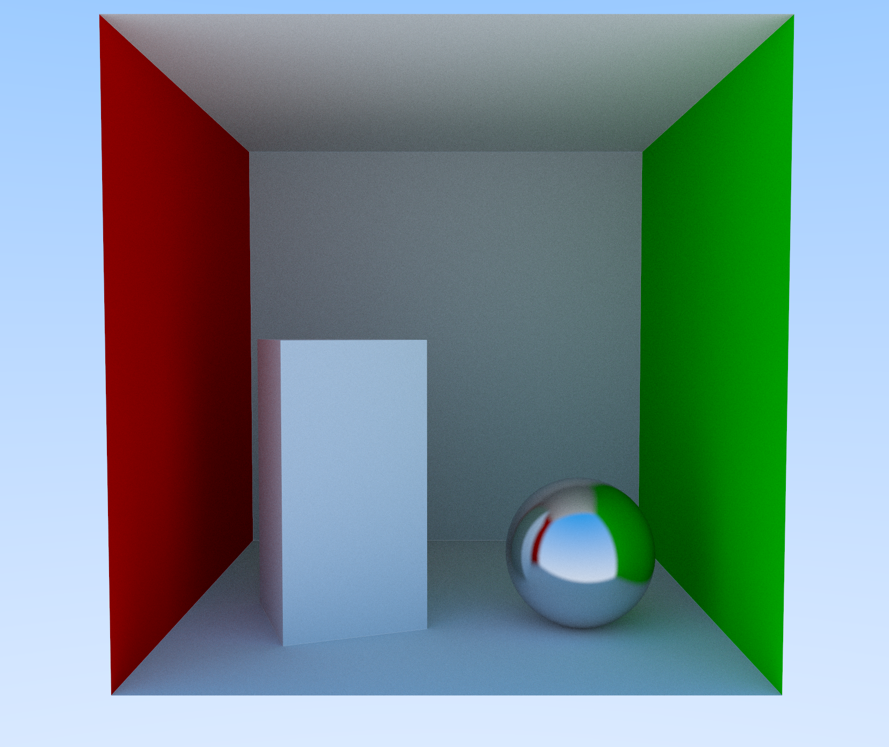
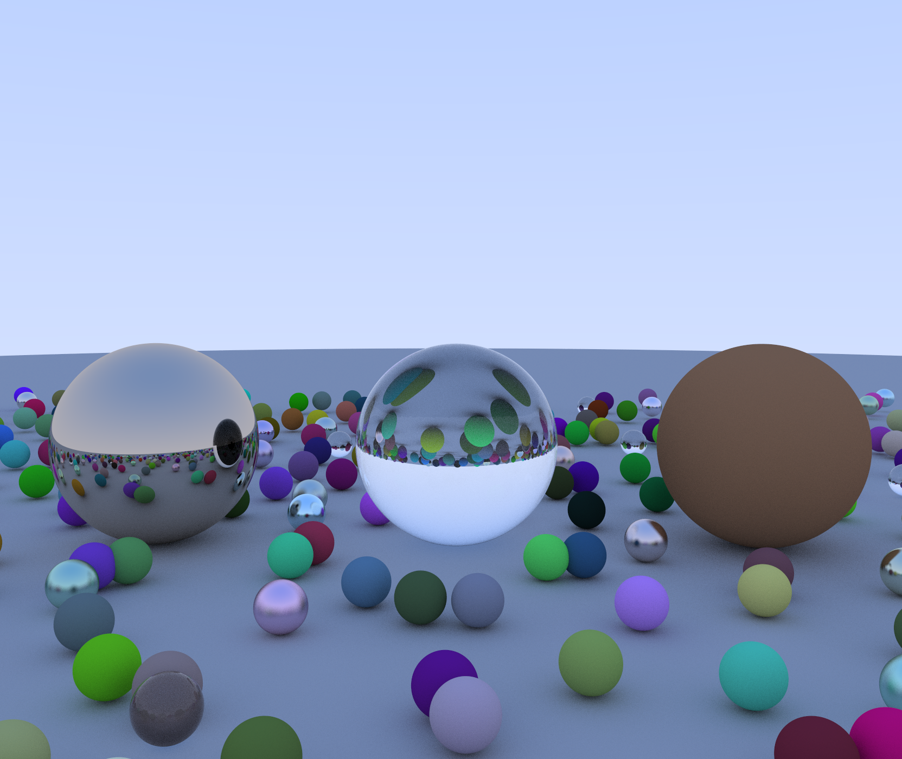
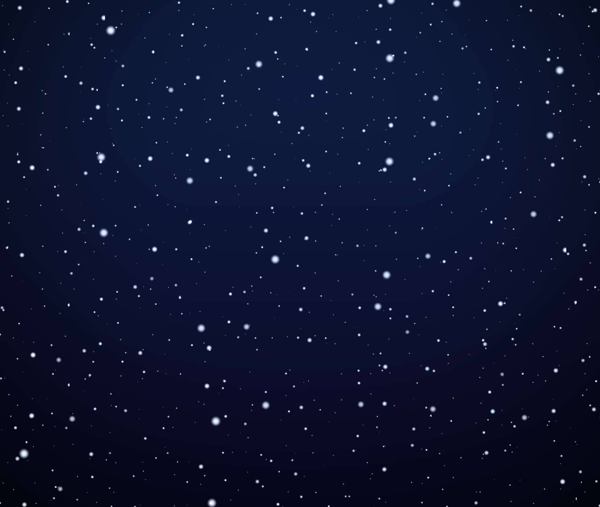
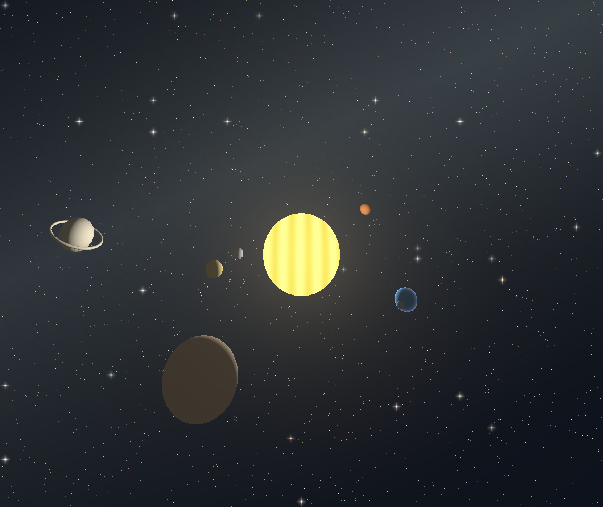

# kcShaders

kcShaders is a rendering engine based on OpenGL and GLSL, with a focus on real-time graphics and shader development.

<!-- Insert the figure of the UI here -->


## Features
Various rendering modes:
- Rasterization
- Ray Tracing
- Shadertoy

USD scene loading and rendering:
- Scene graph management
- Material and texture support

## Requirements
- OpenGL 4.3 or higher
- [OpenUSD SDK](https://developer.nvidia.cn/openusd)

## Building
```bash
git clone https://github.com/Analysis196884/kcShaders.git
cd kcShaders
mkdir build && cd build
cmake ..
make
```

## Gallery
### Rasterization:



### Ray Tracing:



### Shadertoy:


